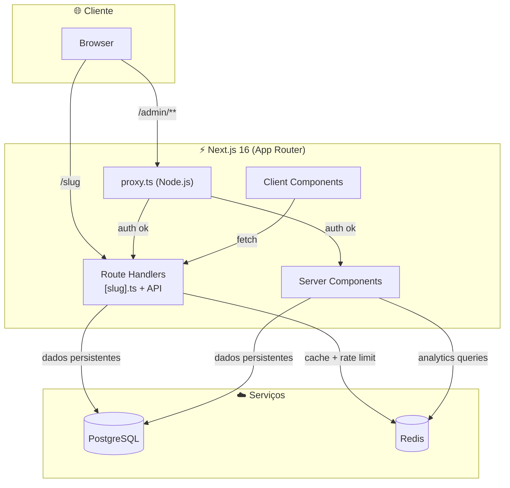
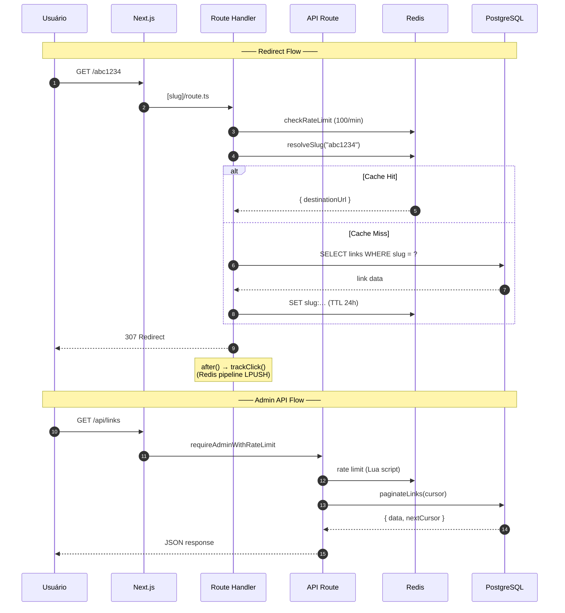

# Arquitetura

## Stack



## Estrutura de Pastas

```
src/
├── app/                    # App Router (páginas + API)
│   ├── [slug]/
│   │   └── route.ts        # Motor de redirect (Node.js)
│   ├── admin/
│   │   ├── layout.tsx      # QueryProvider
│   │   ├── login/          # Página de login (GSAP)
│   │   ├── (dashboard)/    # Layout protegido com nav
│   │   │   ├── links/      # Gerenciamento de links
│   │   │   └── analytics/  # Dashboard de analytics
│   │   └── page.tsx        # redirect → /admin/links
│   └── api/                # REST API
│       ├── auth/login
│       ├── links/
│       ├── analytics/
│       └── cache/wipe
├── components/             # UI components
│   ├── ui/                 # shadcn primitives
│   ├── links/              # Link list, card, forms
│   ├── analytics/
│   └── charts/             # Recharts wrappers
└── lib/                    # Core logic
    ├── db/                 # Drizzle schema + queries
    ├── redis/              # Cache client + rate limiter + buffer
    ├── analytics/          # Click tracking + flush
    ├── auth/               # JWT, session, guards, actions
    ├── validators/         # Zod schemas + SSRF filter
    └── hooks/              # React hooks
```

## Ciclo de Vida de uma Requisição



## Componentes e suas Responsabilidades

### Server-Side

| Componente | Arquivo | Papel |
|---|---|---|
| Redirect Engine | `src/app/[slug]/route.ts` | Resolve slug, rate limit, redireciona |
| Auth Guard | `src/proxy.ts` | Protege rotas `/admin/*`, verifica JWT |
| Auth Guard (API) | `src/lib/auth/require-admin-with-rate-limit.ts` | Verifica cookie JWT + rate limit em APIs |
| Rate Limiter | `src/lib/redis/rate-limit.ts` | Lua script p/ sliding window |
| Slug Cache | `src/lib/redis/index.ts` | Cache-aside de slugs |
| Queries | `src/lib/db/queries/` | SQL tipado via Drizzle |

### Client-Side (Admin)

| Componente | Arquivo | Papel |
|---|---|---|
| QueryProvider | `src/components/query-provider.tsx` | React Query provider |
| LinkList | `src/components/links/link-list.tsx` | Infinite scroll list |
| Login | `src/app/admin/login/page.tsx` | Formulário de login com GSAP |
| DashboardLayout | `src/app/admin/(dashboard)/layout.tsx` | Nav + GSAP entrance animation |

---

[← Visão Geral](visao-geral.md) · [Fluxo de Dados →](fluxo-de-dados.md)
