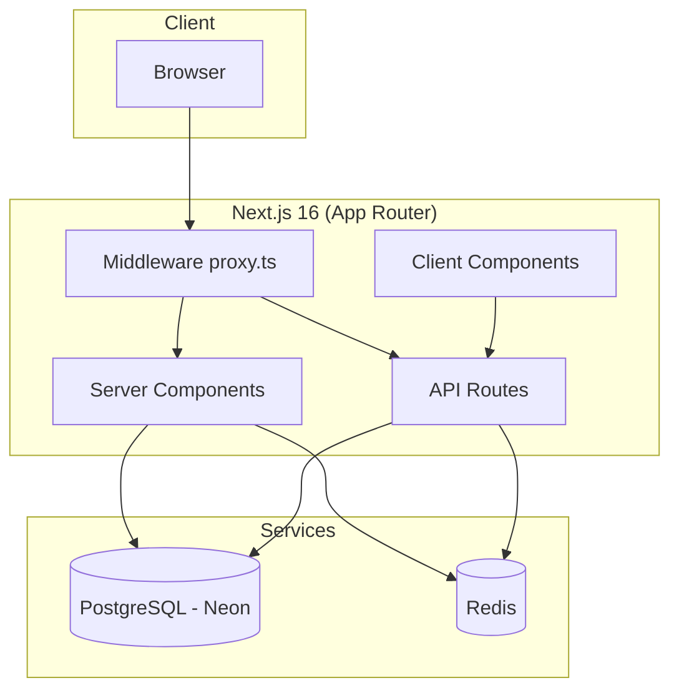
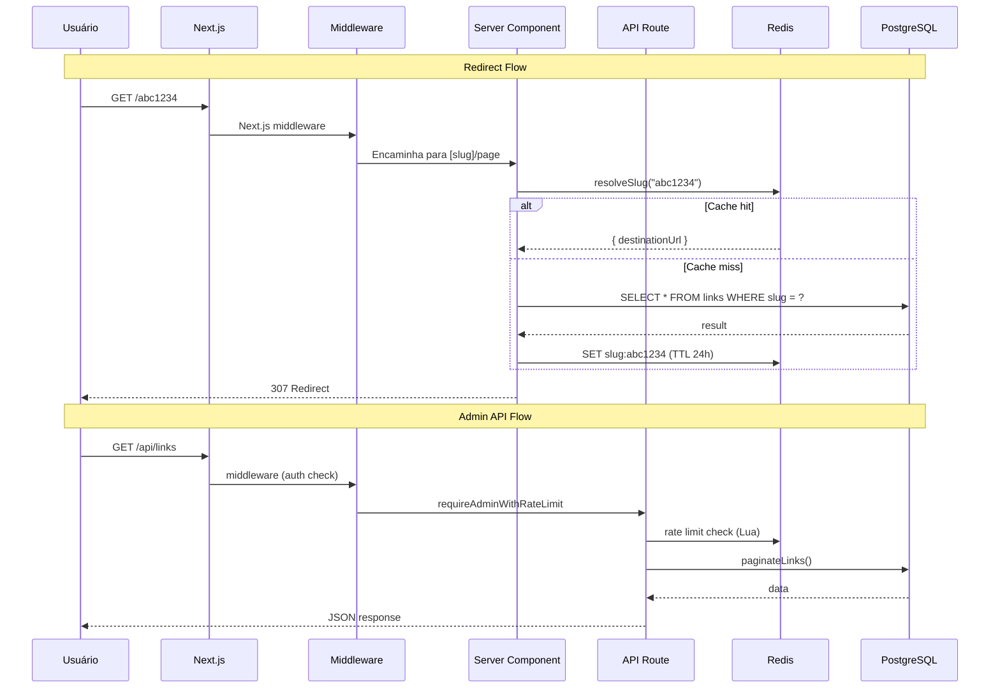

# Arquitetura

## Stack



## Estrutura de Pastas

```
src/
├── app/                    # App Router (páginas + API)
│   ├── [slug]/
│   │   └── page.tsx        # Motor de redirect
│   ├── admin/
│   │   ├── login/          # Página de login
│   │   └── (dashboard)/    # Layout protegido
│   │       ├── links/      # Gerenciamento de links
│   │       └── analytics/  # Dashboard de analytics
│   └── api/                # REST API
│       ├── auth/login
│       ├── links/
│       ├── analytics/
│       └── ...
├── components/             # UI components
│   ├── ui/                 # shadcn/base-ui primitives
│   ├── links/              # Link list, card, forms
│   ├── analytics/
│   └── charts/             # Recharts wrappers
└── lib/                    # Core logic
    ├── db/                 # Drizzle schema + queries
    ├── redis/              # Cache client + rate limiter
    ├── analytics/          # Click tracking + flush
    ├── auth/               # JWT, session, middleware
    ├── validators/         # Zod schemas + SSRF filter
    └── hooks/              # React hooks
```

## Ciclo de Vida de uma Requisição



## Componentes e suas Responsabilidades

### Server-Side

| Componente | Arquivo | Papel |
|---|---|---|
| Redirect Engine | `src/app/[slug]/page.tsx` | Resolve slug, aplica rate limit, redireciona |
| Middleware | `src/proxy.ts` | Protege rotas `/admin/*`, verifica JWT |
| Auth Guard | `src/lib/auth/require-admin.ts` | Verifica cookie JWT em APIs |
| Rate Limiter | `src/lib/redis/rate-limit.ts` | Lua script p/ sliding window |
| Cache | `src/lib/redis/index.ts` | Cache-aside de slugs |
| Queries | `src/lib/db/queries/` | SQL tipado via Drizzle |

### Client-Side (Admin)

| Componente | Arquivo | Papel |
|---|---|---|
| QueryProvider | `src/components/query-provider.tsx` | React Query provider |
| LinkList | `src/components/links/link-list.tsx` | Infinite scroll list |
| AnalyticsDashboard | `src/components/analytics/` | Gráficos + filtros |
| Login | `src/app/admin/login/page.tsx` | Formulário de login |
