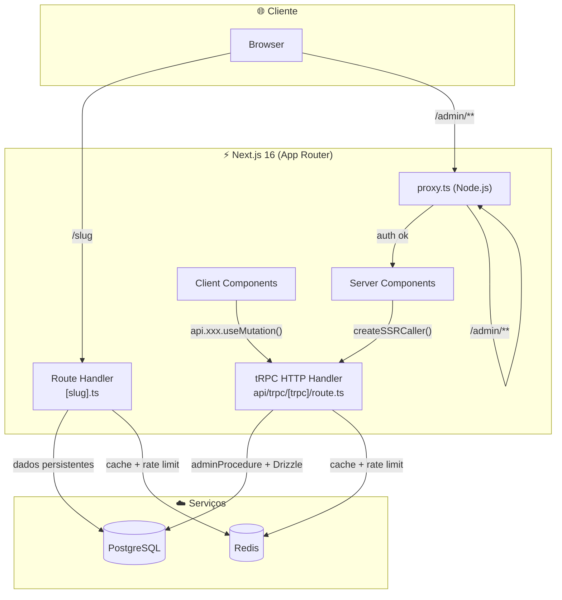
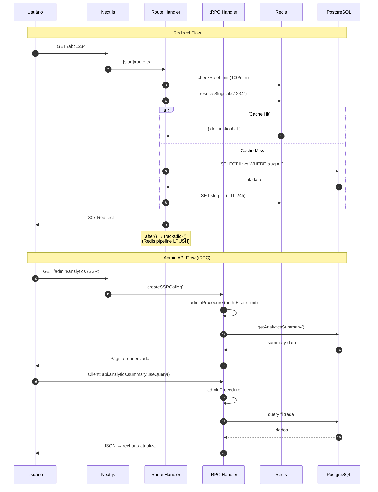

# Arquitetura

## Stack



## Estrutura de Pastas

```
src/
├── app/                    # App Router (páginas + tRPC handler)
│   ├── [slug]/
│   │   └── route.ts        # Motor de redirect (Node.js) — não migrado para tRPC
│   ├── admin/
│   │   ├── layout.tsx      # QueryProvider (TRPCProvider)
│   │   ├── login/          # Página de login (GSAP, tRPC mutation)
│   │   ├── (dashboard)/    # Layout protegido com nav
│   │   │   ├── links/      # SSR via tRPC server caller
│   │   │   └── analytics/  # SSR via tRPC server caller
│   │   └── page.tsx        # redirect → /admin/links
│   └── api/trpc/[trpc]/
│       └── route.ts        # Único HTTP handler tRPC
├── server/                 # tRPC
│   ├── trpc.ts             # Context, middleware, procedures builders
│   └── routers/
│       ├── _app.ts         # appRouter
│       ├── auth.ts         # login mutation
│       ├── links.ts        # CRUD
│       ├── analytics.ts    # Queries
│       └── cache.ts        # Wipe
├── components/             # UI components
│   ├── ui/                 # shadcn primitives
│   ├── links/              # Link list, card, forms (tRPC hooks)
│   ├── analytics/
│   └── charts/             # Recharts wrappers
├── lib/
│   ├── trpc/               # tRPC client + server caller
│   ├── db/                 # Drizzle schema + queries
│   ├── redis/              # Cache client + rate limiter + buffer
│   ├── analytics/          # Click tracking + flush
│   ├── auth/               # JWT, session, guards, actions
│   ├── validators/         # Zod schemas + SSRF filter
│   └── hooks/              # React hooks
└── proxy.ts                # Auth guard (/admin/**)
```

## Ciclo de Vida de uma Requisição



## Componentes e suas Responsabilidades

### Server-Side

| Componente | Arquivo | Papel |
|---|---|---|
| Redirect Engine | `src/app/[slug]/route.ts` | Resolve slug, rate limit, redireciona |
| Auth Guard | `src/proxy.ts` | Protege rotas `/admin/*`, verifica JWT |
| tRPC Handler | `src/app/api/trpc/[trpc]/route.ts` | HTTP handler único para todas as APIs |
| tRPC Middleware | `src/server/trpc.ts` | `adminProcedure`, `adminMutationProcedure` |
| Rate Limiter | `src/lib/redis/rate-limit.ts` | Lua script p/ sliding window |
| Slug Cache | `src/lib/redis/index.ts` | Cache-aside de slugs |
| Queries | `src/lib/db/queries/` | SQL tipado via Drizzle |

### Client-Side (Admin)

| Componente | Arquivo | Papel |
|---|---|---|
| TRPCProvider | `src/lib/trpc/react.tsx` | tRPC + React Query provider |
| QueryProvider | `src/components/query-provider.tsx` | Wrapper do TRPCProvider |
| LinkList | `src/components/links/link-list.tsx` | Infinite scroll list via tRPC |
| Login | `src/app/admin/login/page.tsx` | Formulário com `auth.login.useMutation()` |
| AnalyticsDashboard | `src/app/admin/(dashboard)/analytics/analytics-dashboard.tsx` | Queries tRPC com filtro |
| Charts | `src/components/charts/` | Recharts wrappers |

---

[← Visão Geral](visao-geral.md) · [Fluxo de Dados →](fluxo-de-dados.md)
