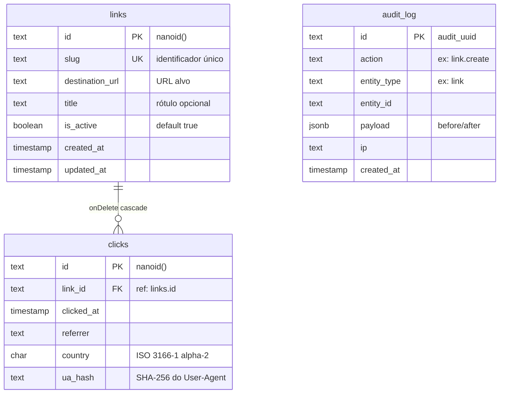

# Banco de Dados

PostgreSQL via Neon (serverless). ORM: Drizzle.

## Schema



## Índices

```sql
-- clicks
CREATE INDEX clicks_link_id_idx ON clicks(link_id);
CREATE INDEX clicks_clicked_at_idx ON clicks(clicked_at);
CREATE INDEX clicks_link_id_clicked_at_idx ON clicks(link_id, clicked_at);

-- links
-- slug já tem UNIQUE (índice automático)
-- id é PK (índice automático)
```

## Queries Principais

### Resolver Slug (redirect)

```sql
SELECT id, destination_url, is_active
FROM links
WHERE slug = ? AND is_active = true
LIMIT 1;
```

Cacheado em Redis por 24h.

### Paginação Cursor-Based

```sql
SELECT id, slug, title, destination_url, is_active, created_at, updated_at
FROM links
WHERE (created_at < $cursor_createdAt
    OR (created_at = $cursor_createdAt AND id < $cursor_id))
ORDER BY created_at DESC, id DESC
LIMIT $limit + 1;
```

O cursor é a codificação base64 de `{ createdAt: string, id: string }`. Retorna `limit + 1` registros para saber se há próxima página.

### Analytics: Summary

```sql
SELECT
  COUNT(*) AS total_clicks,
  DATE(clicked_at) AS peak_day,
  COUNT(*) AS peak_day_clicks
FROM clicks
WHERE clicked_at BETWEEN $from AND $to
GROUP BY DATE(clicked_at)
ORDER BY COUNT(*) DESC
LIMIT 1;
```

### Analytics: Clicks Over Time

```sql
SELECT DATE(clicked_at) AS date, COUNT(*) AS clicks
FROM clicks
WHERE clicked_at BETWEEN $from AND $to
  AND ($linkId IS NULL OR link_id = $linkId)
GROUP BY DATE(clicked_at)
ORDER BY date ASC;
```

### Analytics: Top Referrers

```sql
SELECT
  COALESCE(NULLIF(SPLIT_PART(referrer, '/', 3), ''), 'direct') AS hostname,
  COUNT(*) AS clicks
FROM clicks
WHERE clicked_at BETWEEN $from AND $to
  AND ($linkId IS NULL OR link_id = $linkId)
GROUP BY hostname
ORDER BY clicks DESC
LIMIT 20;
```

### Batch Insert Clicks (flush)

```sql
INSERT INTO clicks (id, link_id, clicked_at, referrer, country, ua_hash)
VALUES ($1, $2, $3, $4, $5, $6), ...;
```

## Conexão

```typescript
// src/lib/db/index.ts
import "server-only";  // ← Garante que nunca é importado no client

const pool = new Pool({ connectionString: env.DATABASE_URL });
export const db = drizzle(pool, { schema });
```

O uso de `"server-only"` impede que o bundler inclua este módulo no client.

## Migrations

```bash
bunx drizzle-kit generate  # Gera SQL das mudanças
bunx drizzle-kit migrate   # Aplica no banco
bunx drizzle-kit studio    # UI para ver dados
```
