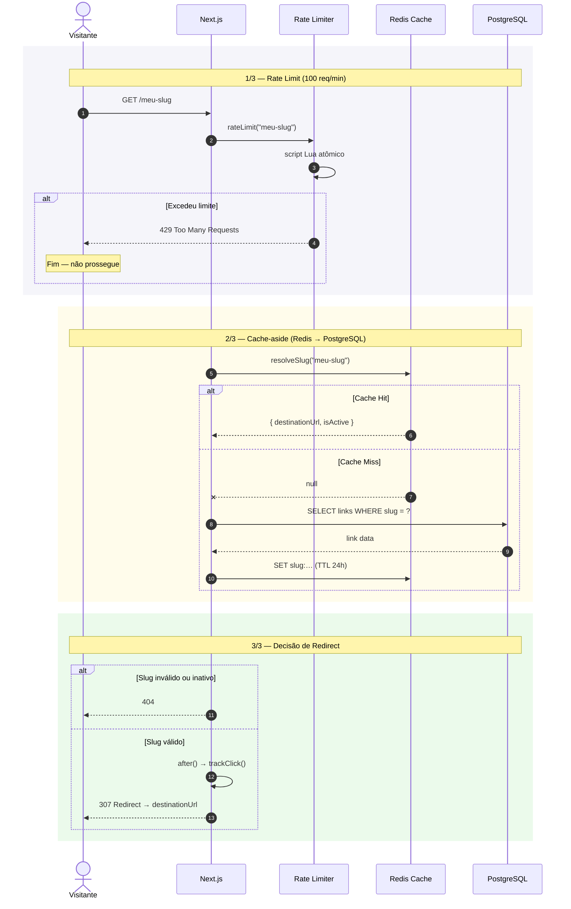
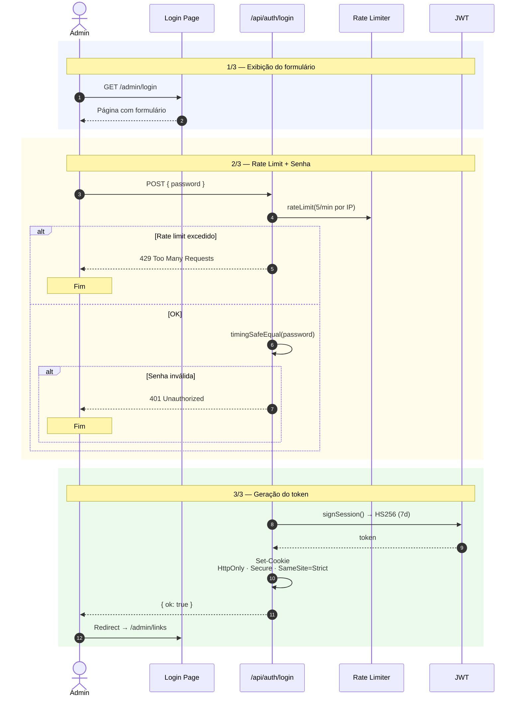
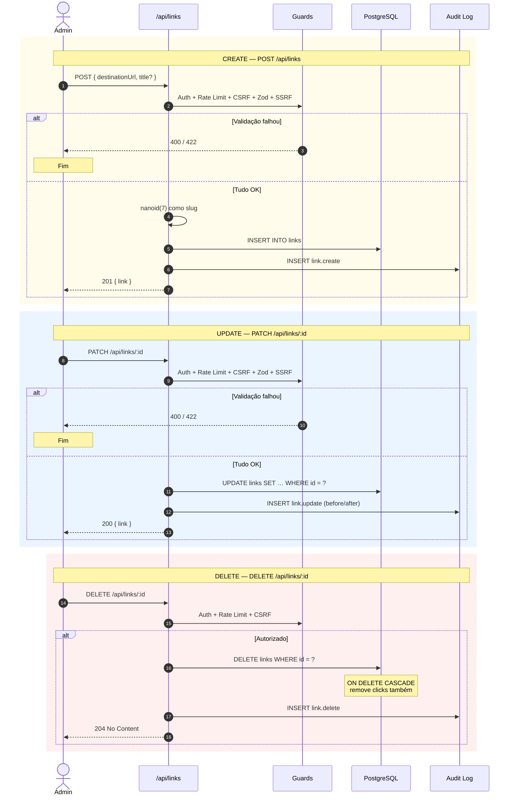
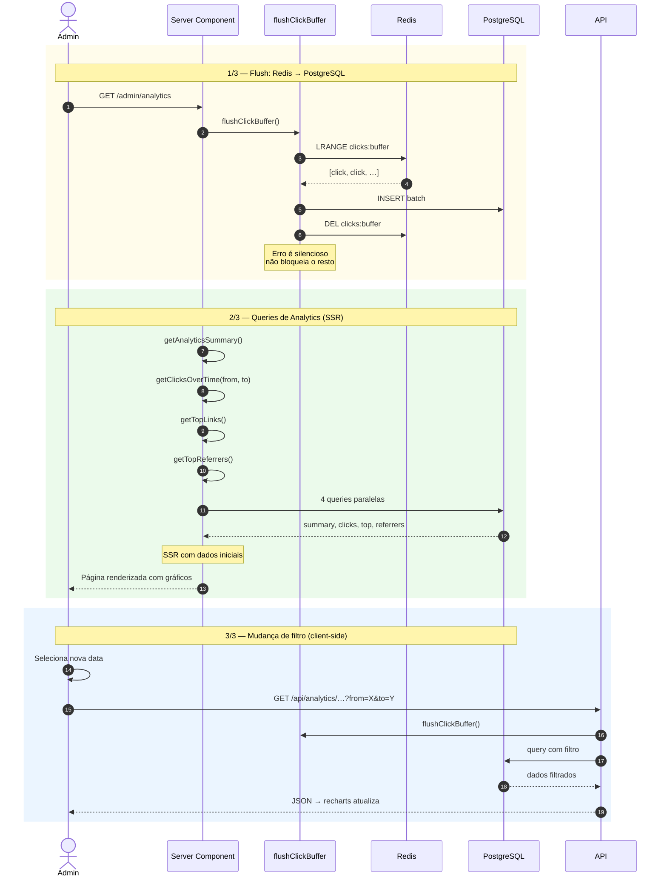
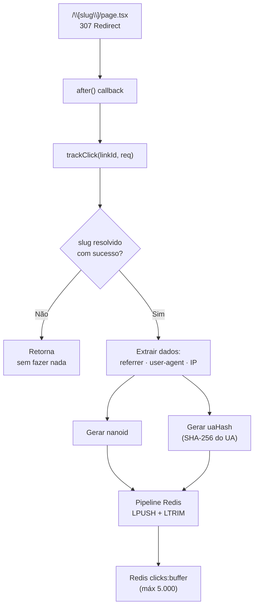

# Fluxo de Dados

## 1. Redirect (o caminho crítico)

### Pontos-chave:
- **Rate limit** vem primeiro — evita trabalho desnecessário
- **Cache-aside**: Redis primeiro, PG depois
- **trackClick()** roda dentro de `after()` — nunca bloqueia o redirect
- **307 redirect**: método HTTP preservado (GET permanece GET)

---

## 2. Admin — Login

### Pontos-chave:
- **timingSafeEqual** — comparação em tempo constante contra timing attack
- **5 req/min** — proteção contra brute force
- **Cookie HttpOnly** — não acessível via JS

---

## 3. Admin — CRUD de Links

---

## 4. Analytics

### Pontos-chave:
- **flushClickBuffer()** é chamado antes de toda query de analytics
- SSR envia dados iniciais; mudanças de filtro disparam fetch no client
- Validação de data: máximo 365 dias de janela

---

## 5. Tracking de Clique (detalhado)

O flush (escrita no PG) é explicado em [Processos em Background](processos-background.md).

---

[← Arquitetura](arquitetura.md) · [Banco de Dados →](banco-de-dados.md)
