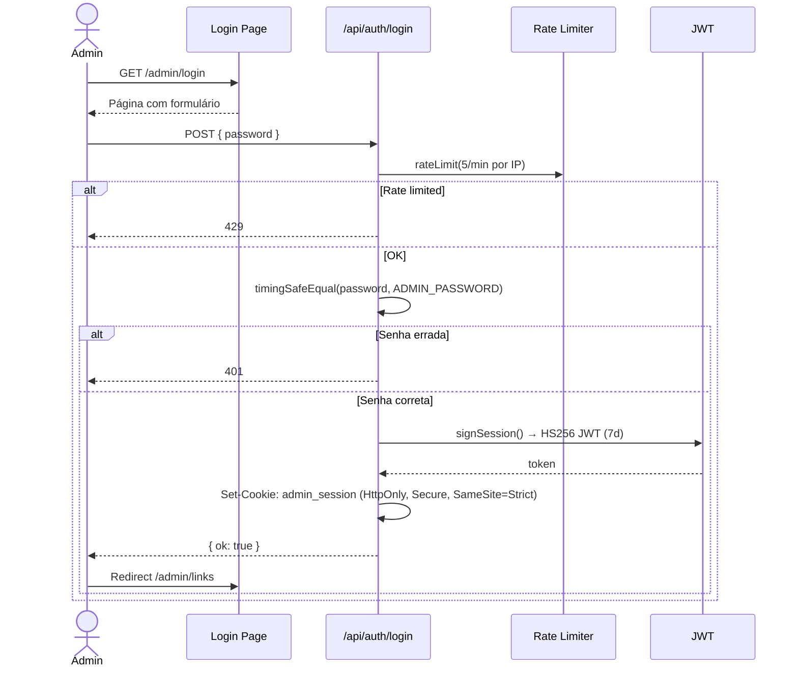
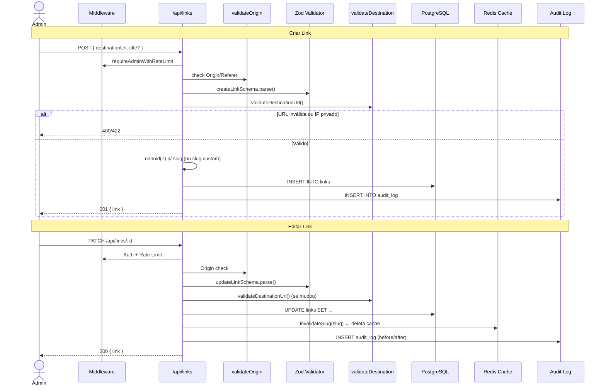
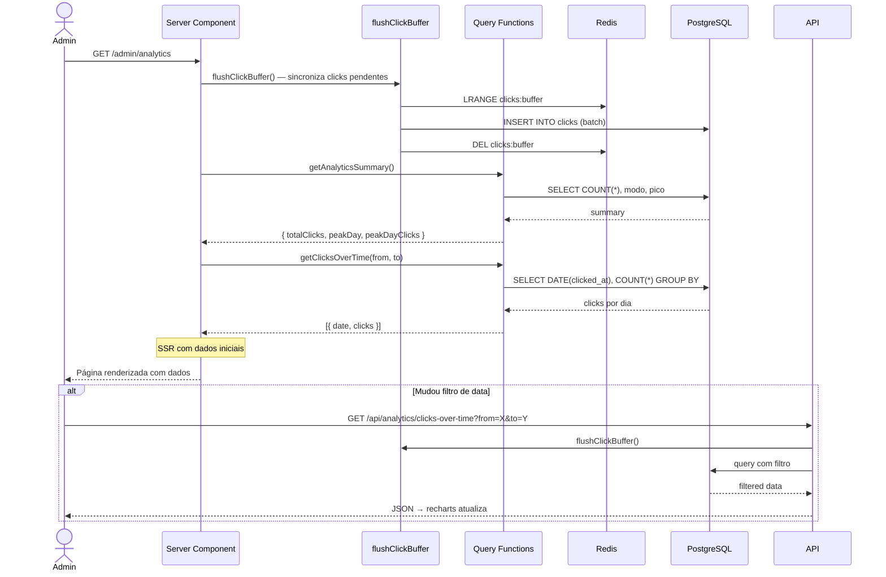
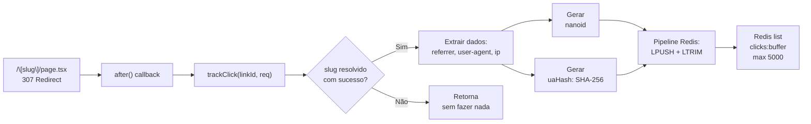

# Fluxo de Dados

## 1. Redirect (o caminho crítico)

```mermaid
sequenceDiagram
    actor V as Visitante
    participant N as Next.js
    participant RL as Rate Limiter
    participant C as Redis Cache
    participant DB as PostgreSQL

    V->>N: GET /meu-slug
    N->>RL: rateLimit(100/min)
    RL->>RL: script Lua atômico
    alt Rate limited
        RL-->>V: 429 Too Many Requests
    else OK
        RL-->>N: allowed
        N->>C: resolveSlug("meu-slug")
        alt Cache Hit
            C-->>N: { id, destinationUrl, isActive }
        else Cache Miss
            C-x--N: null
            N->>DB: SELECT FROM links WHERE slug = ?
            DB-->>N: link data
            N->>C: SET slug:meu-slug (TTL 24h)
        end
        alt Slug inválido ou inativo
            N-->>V: 404
        else Slug válido
            N->>N: after() → trackClick()
            N-->>V: 307 Redirect → destinationUrl
        end
    end
```

### Pontos-chave:
- **Rate limit** vem primeiro — evita trabalho desnecessário
- **Cache-aside**: Redis primeiro, PG depois
- **trackClick()** roda dentro de `after()` — nunca bloqueia o redirect
- **307 redirect**: método HTTP preservado (GET permanece GET)

---

## 2. Admin — Login



### Pontos-chave:
- **timingSafeEqual** — comparação em tempo constante contra timing attack
- **5 req/min** — proteção contra brute force
- **Cookie HttpOnly** — não acessível via JS

---

## 3. Admin — CRUD de Links



---

## 4. Analytics



### Pontos-chave:
- **flushClickBuffer()** é chamado antes de toda query de analytics
- SSR envia dados iniciais; mudanças de filtro disparam fetch no client
- Validação de data: máximo 365 dias de janela

---

## 5. Tracking de Clique (detalhado)



O flush (escrita no PG) é explicado em [Processos em Background](processos-background.md).
