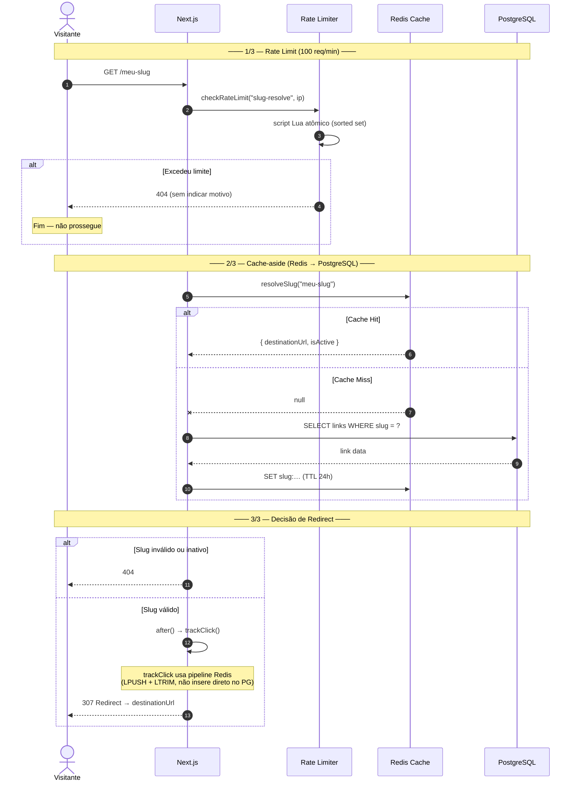
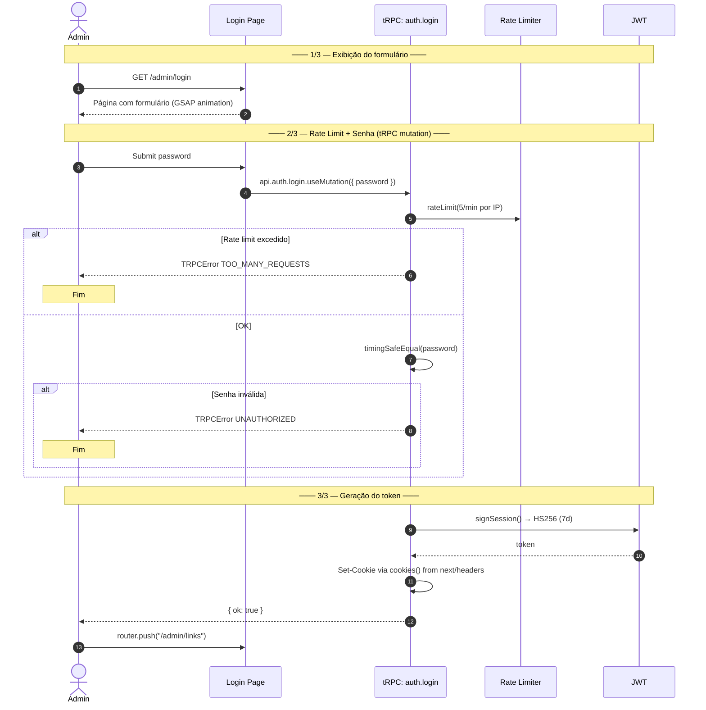
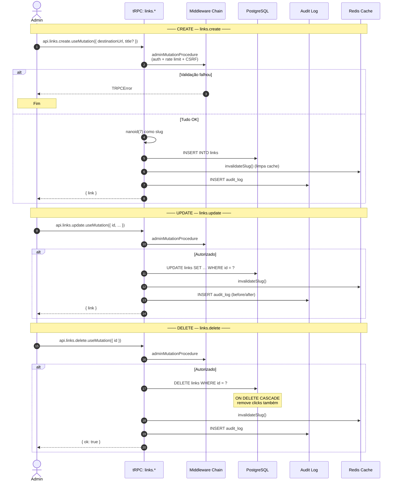
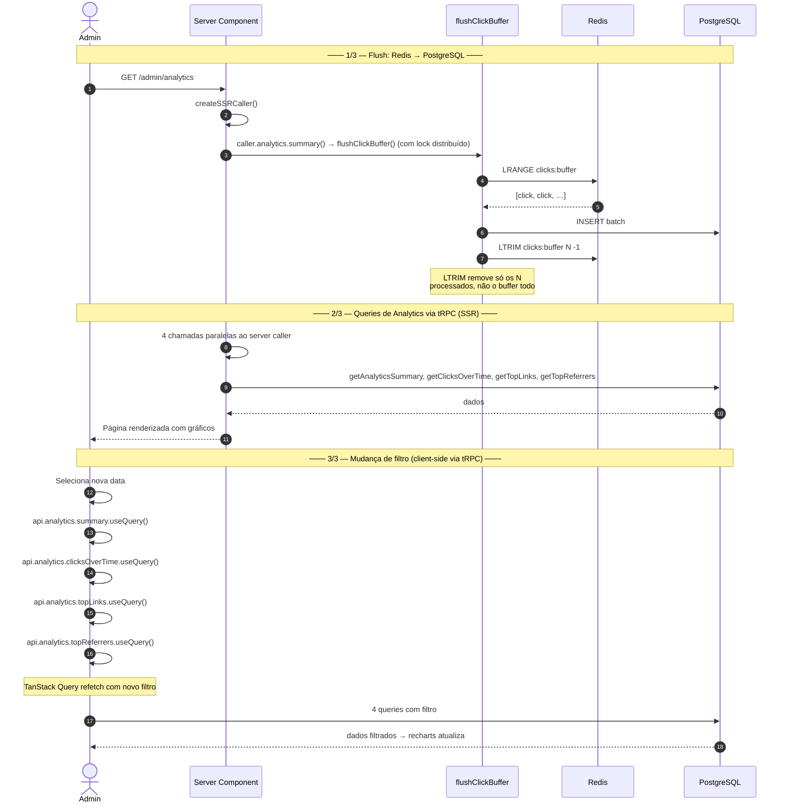
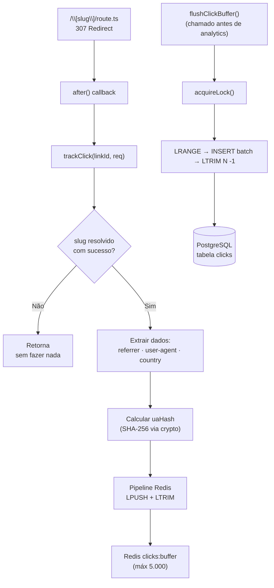

# Fluxo de Dados

## 1. Redirect (o caminho crítico)

### Pontos-chave:
- **Rate limit** roda em paralelo com slug resolution (`Promise.all`)
- **Cache-aside**: Redis primeiro, PG depois
- **trackClick()** escreve em pipeline Redis, não direto no PostgreSQL
- **after()** substitui o padrão waitUntil anterior
- **307 redirect**: método HTTP preservado (GET permanece GET)

---

## 2. Admin — Login

### Pontos-chave:
- **timingSafeEqual** — comparação em tempo constante contra timing attack
- **5 req/min** — proteção contra brute force
- **Cookie HttpOnly + SameSite=Strict** — não acessível via JS
- Login usa `publicProcedure` com rate limit manual (diferente do middleware global)

---

## 3. Admin — CRUD de Links (via tRPC)

---

## 4. Analytics (via tRPC)

### Pontos-chave:
- **flushClickBuffer()** é chamado antes de toda query de analytics (dentro das funções Drizzle)
- **Lock distribuído** (SET NX PX 30000) previne duplicação entre 4 chamadas paralelas
- **LTRIM** remove só os registros processados, nunca dados concorrentes
- SSR usa `createSSRCaller()` para dados iniciais (passados como props fallback); mudanças de filtro usam `useQuery` via tRPC (refetch automático)
- Validação de data: máximo 365 dias de janela

---

## 5. Tracking de Clique (detalhado)

---

[← Arquitetura](arquitetura.md) · [Banco de Dados →](banco-de-dados.md)
