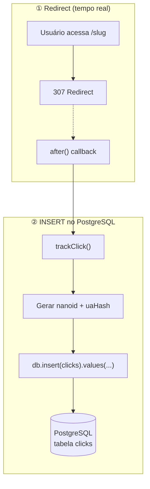
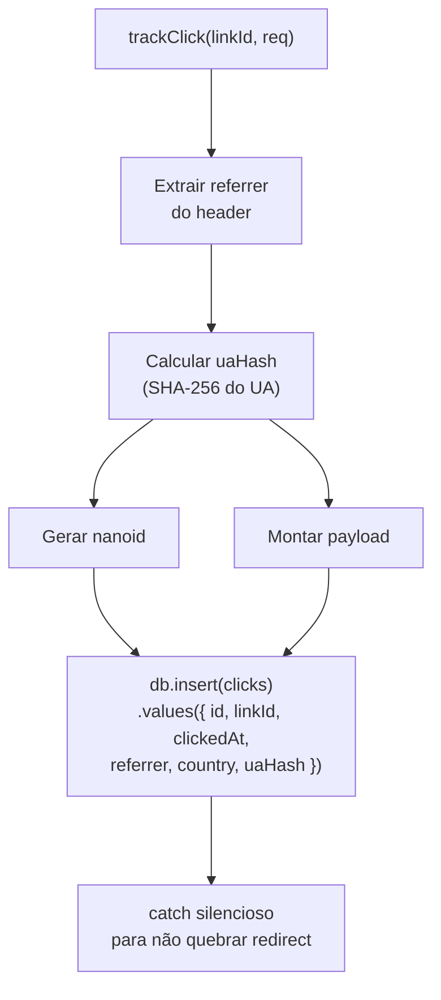

# Processos em Background

O Bit Link **não tem** buffer Redis para clicks. Todo click é inserido **diretamente no PostgreSQL** através do callback `after()` do Next.js, que executa após o redirect ser enviado ao cliente.

## Pipeline de Tracking de Cliques



## Arquitetura Anterior (Redis Buffer) vs. Atual

| Característica | Antes (Redis Buffer) | Agora (INSERT direto) |
|---|---|---|
| Onde o click é escrito | Redis `clicks:buffer` | PostgreSQL `clicks` |
| Quando é persistido | Só no próximo acesso a analytics | Imediatamente (via `after()`) |
| Fonte da verdade | PostgreSQL (eventual) | PostgreSQL (imediata) |
| Perda de dados se Redis cair | Sim, clicks no buffer perdidos | Não |
| Stale data após truncar PG | Sim, Redis reinseria | Não |
| Cache dependente de PG? | Não (PG dependia do flush) | Sim (cache → PG) |

## Código Principal

### trackClick (src/lib/analytics/track.ts)



```typescript
export async function trackClick(input: TrackClickInput): Promise<void> {
  try {
    const uaHash = input.userAgent ? sha256hex(input.userAgent) : null;

    await db.insert(clicks).values({
      id: nanoid(),
      linkId: input.linkId,
      clickedAt: new Date(),
      referrer: input.referrer,
      country: input.country?.slice(0, 2) ?? null,
      uaHash,
    });
  } catch {
    // intentionally swallowed — tracking MUST NOT affect redirect
  }
}
```

### Wipe Cache (src/lib/redis/cache.ts)

O cache de slugs no Redis pode ser limpo via dashboard (botão "Limpar Cache") ou chamando `POST /api/cache/wipe`. O Redis é repopulado automaticamente na próxima requisição via cache-aside.

```typescript
export async function clearSlugCache(): Promise<number> {
  // SCAN slug:* → DEL
}
```

## E se...?

| Cenário | O que acontece |
|---|---|
| PG cai durante redirect | `trackClick` falha silenciosamente → click perdido, mas redirect funciona |
| Redis cai durante redirect | Redirect funciona (slug é resolvido via PG direto, sem cache) |
| Cache de slug expirado | Próximo redirect faz cache miss → busca no PG → repopula cache |

---

[← Banco de Dados](banco-de-dados.md) · [README →](README.md)
