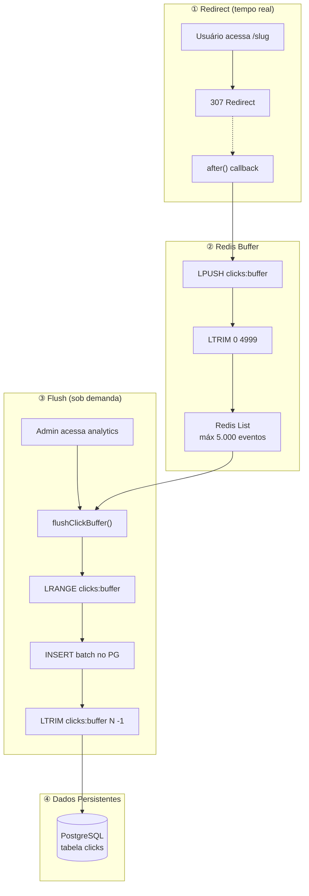
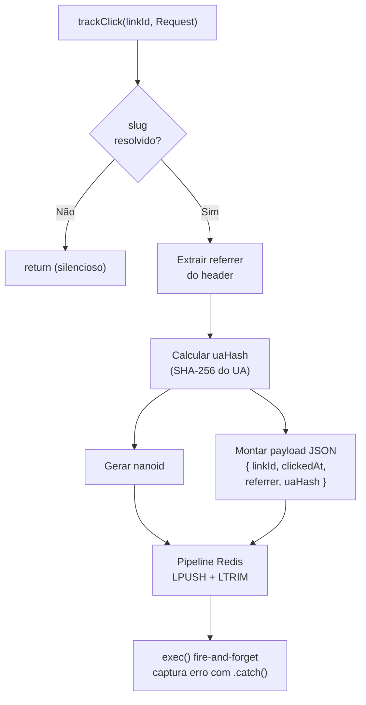
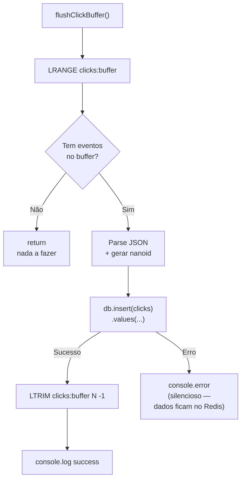

# Processos em Background

O Bit Link **não tem** um sistema de filas dedicado (Bull, RabbitMQ, etc.). O processamento em background usa **Redis como buffer temporário** com flush confiável para PostgreSQL.

## Pipeline de Tracking de Cliques



## Por que LTRIM em vez de DEL?

No modelo anterior, `flushClickBuffer()` usava `DEL clicks:buffer` após o INSERT. Isso causava dois problemas:

1. **Race condition**: se um novo click chegasse via `after()` entre o `LRANGE` e o `DEL`, ele era perdido
2. **Re-inserção**: se o INSERT falhasse parcialmente, o buffer não era limpo e na próxima tentativa os mesmos dados eram re-inseridos

A solução é usar `LTRIM clicks:buffer N -1` (onde N = quantidade lida). Isso:
- Remove **apenas** os registros que foram lidos e processados
- Preserva clicks que chegaram concorrentemente
- Se o INSERT falhar, os dados permanecem no buffer para retry

```typescript
// flush-clicks.ts
const raw = await redis.lrange(BUFFER_KEY, 0, -1);
if (raw.length === 0) return;

const records = raw.map(parseEntry);
await db.insert(clicks).values(records);
await redis.ltrim(BUFFER_KEY, raw.length, -1);
//       ↑ só remove os N processados
```

## Código Principal

### trackClick (src/lib/analytics/track.ts)



```typescript
// Simplificado
const pipeline = redis.pipeline();
pipeline.lpush(bufferKey, JSON.stringify(clickEvent));
pipeline.ltrim(bufferKey, 0, MAX_BUFFER_SIZE - 1);
pipeline.exec().catch(() => {});
```

### Deduplicação de Cliques

O `after()` combinado com `redirect()` pode registrar o callback múltiplas vezes por requisição em alguns cenários (React 19 + React Compiler). Para evitar contagem múltipla, o `trackClick()` usa `SET NX` com TTL de 10s:

```typescript
const dedupKey = `dedup:click:${linkId}`;
const ok = await redis.set(dedupKey, "1", "EX", 10, "NX");
if (!ok) return; // já registrado — descarta duplicata
```

Apenas o primeiro callback within 10 segundos para o mesmo link registra o click. Os seguintes são ignorados. Isso previne super-contagem sem prejudicar a performance (1 round-trip extra ao Redis, ~1ms).

### flushClickBuffer (src/lib/analytics/flush-clicks.ts)



## E se...?

| Cenário | O que acontece |
|---|---|
| Redis cai durante redirect | `trackClick` falha silenciosamente → click perdido, mas redirect funciona |
| Redis cai durante flush | Erro logado, dados ficam no Redis até próxima tentativa |
| PG cai durante flush | Erro logado, buffer Redis mantém dados |
| Dois flushes simultâneos | `LTRIM` previne duplicação: cada um remove só seus registros |
| Buffer chega a 5000 | `LTRIM` no `trackClick` mantém só os 5000 mais recentes |
| Tabela clicks truncada | Buffer pode ter dados não-flushados ainda (correto — serão persistidos) |
| `after()` registrado múltiplas vezes | Dedup `SET NX` descarta duplicatas dentro de 10s |

## Cache de Slugs (Wipe Cache)

O cache de slugs (`slug:*` no Redis) segue o padrão **cache-aside**: o Redis é populado a partir do PostgreSQL e pode ser limpo sem perda.

O botão **"Limpar Cache"** no dashboard chama `POST /api/cache/wipe`, que executa `clearSlugCache()` (SCAN + DEL nos `slug:*`). Na próxima requisição, o cache é repopulado automaticamente via `resolveSlug()`.

`invalidateSlug()` é chamado automaticamente ao criar, atualizar ou deletar links.

---

[← Banco de Dados](banco-de-dados.md) · [README →](README.md)
