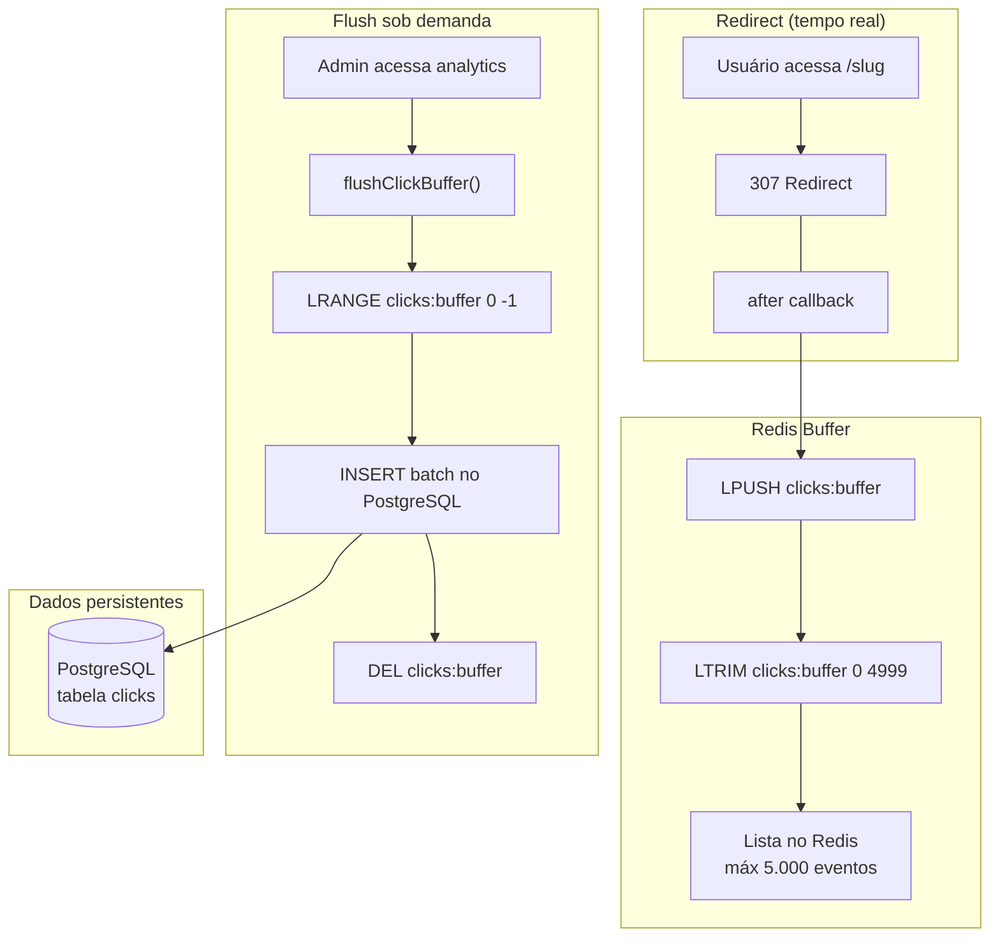
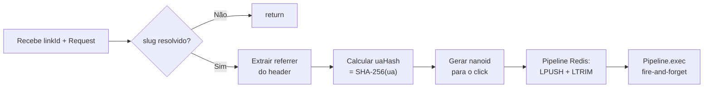
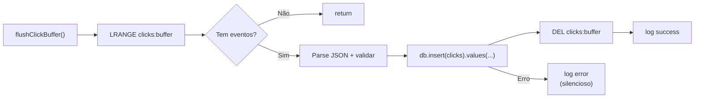

# Processos em Background

O Bit Link **não tem** um sistema de filas dedicado (Bull, RabbitMQ, etc.). O processamento em background é feito de forma **assíncrona e sob demanda** usando Redis como buffer.

## Pipeline de Tracking de Cliques



## Por que esse design?

### Sem fila dedicada
- **Prós**: Zero infra extra (só Redis, que já usamos), deploy simples
- **Contras**: Dados de click podem ficar inconsistentes por minutos/horas se ninguém acessar analytics

### Buffer no Redis
- `LPUSH` + `LTRIM` é O(1) — impacto mínimo no redirect
- Cap de 5.000 entradas evita estouro de memória
- Se o Redis cair, clicks são perdidos (trade-off assumido)

### Flush on Read
- `flushClickBuffer()` roda antes de toda query de analytics
- Se falhar (Redis offline, PG fora), o erro é silencioso — analytics retorna dados já persistidos
- Em produção com alto tráfego, seria ideal um cron job (`cron job` no Vercel, `pg_cron`, etc.) chamando `flushClickBuffer()` a cada 30s

## Código Principal

### trackClick (src/lib/analytics/track.ts)



```typescript
// Simplificado
const pipeline = redis.pipeline();
pipeline.lpush(bufferKey, JSON.stringify(clickEvent));
pipeline.ltrim(bufferKey, 0, MAX_BUFFER_SIZE - 1);
pipeline.exec().catch(() => {});
```

### flushClickBuffer (src/lib/analytics/flush-clicks.ts)



## E se...?

| Cenário | O que acontece |
|---|---|
| Redis cai durante redirect | `trackClick` falha silenciosamente → click perdido, mas redirect funciona |
| Redis cai durante flush | Erro logado, dados ficam no Redis até próxima tentativa |
| PG cai durante flush | Erro logado, buffer Redis mantém dados |
| Dois flushes simultâneos | Podem duplicar inserts (sem unique constraint no click id — **melhorar**: usar `ON CONFLICT DO NOTHING` ou lock) |
| Buffer chega a 5000 | `LTRIM` mantém só os 5000 mais recentes — os mais antigos são descartados |

## Próximos Passos (se precisar escalar)

1. **Cron job**: Agendar `flushClickBuffer()` a cada 30s via Vercel Cron Jobs
2. **Deduplicação**: Adicionar `ON CONFLICT DO NOTHING` no INSERT de clicks
3. **Fila real**: Migrar para Redis Streams + consumidor dedicado

---

[← Banco de Dados](banco-de-dados.md) · [README →](README.md)
