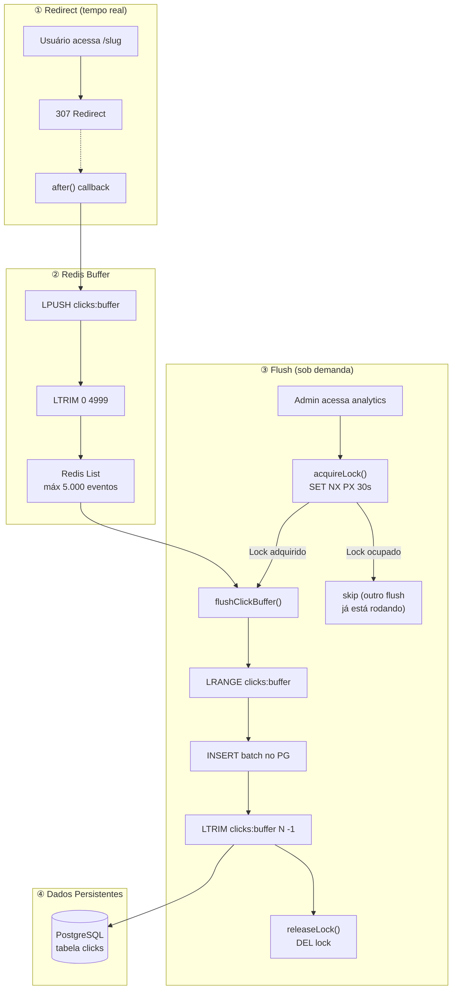
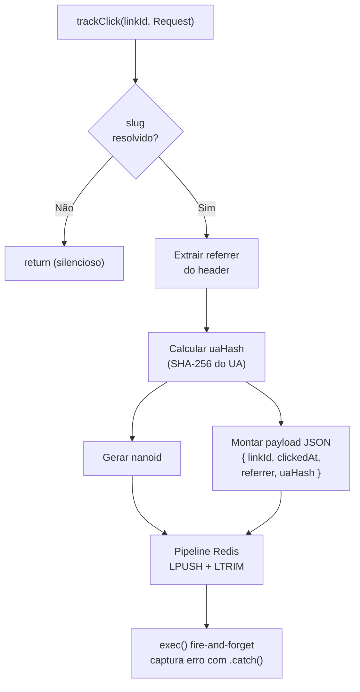
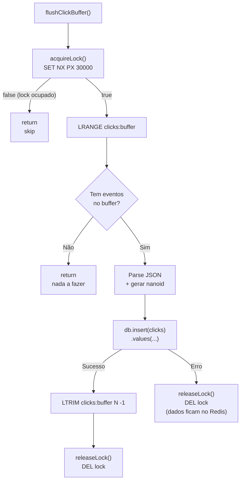

# Processos em Background

O Bit Link **não tem** um sistema de filas dedicado (Bull, RabbitMQ, etc.). O processamento em background usa **Redis como buffer temporário** com flush confiável para PostgreSQL.

## Pipeline de Tracking de Cliques



## Lock Distribuído (Proteção Contra Flushes Concorrentes)

O `flushClickBuffer()` é chamado por **4 queries diferentes** (`getAnalyticsSummary`, `getClicksOverTime`, `getTopLinks`, `getTopReferrers`) que rodam em paralelo via `Promise.all` — tanto no SSR da página de analytics quanto no cliente quando o dashboard faz 4 `fetch()` simultâneos.

Sem proteção, todas as 4 chamadas leem o mesmo `LRANGE` e todas fazem `INSERT` no PostgreSQL, resultando em **cada click replicado 4 vezes**.

A proteção usa um **lock distribuído no Redis**:

```typescript
async function acquireLock(): Promise<boolean> {
  const ok = await redis.set(LOCK_KEY, "1", "PX", 30_000, "NX");
  return ok === "OK";
}
```

- `SET NX`: só um caller adquire o lock por vez
- `PX 30000`: TTL de 30s evita deadlock se o processo crashar
- `DEL` no `finally`: libera o lock ao terminar
- Se o lock não for adquirido (`acquired === false`), a chamada retorna sem fazer nada

## Por que LTRIM em vez de DEL?

No modelo anterior, `flushClickBuffer()` usava `DEL clicks:buffer` após o INSERT. Isso causava dois problemas:

1. **Race condition**: se um novo click chegasse via `after()` entre o `LRANGE` e o `DEL`, ele era perdido
2. **Re-inserção**: se o INSERT falhasse parcialmente, o buffer não era limpo e na próxima tentativa os mesmos dados eram re-inseridos

A solução é usar `LTRIM clicks:buffer N -1` (onde N = quantidade lida). Isso:
- Remove **apenas** os registros que foram lidos e processados
- Preserva clicks que chegaram concorrentemente
- Se o INSERT falhar, os dados permanecem no buffer para retry

```typescript
// flush-clicks.ts
const raw = await redis.lrange(BUFFER_KEY, 0, -1);
if (raw.length === 0) return;

const records = raw.map(parseEntry);
await db.insert(clicks).values(records);
await redis.ltrim(BUFFER_KEY, raw.length, -1);
//       ↑ só remove os N processados
```

## Código Principal

### trackClick (src/lib/analytics/track.ts)



```typescript
// Simplificado
const pipeline = redis.pipeline();
pipeline.lpush(bufferKey, JSON.stringify(clickEvent));
pipeline.ltrim(bufferKey, 0, MAX_BUFFER_SIZE - 1);
pipeline.exec().catch(() => {});
```

### flushClickBuffer (src/lib/analytics/flush-clicks.ts)



## E se...?

| Cenário | O que acontece |
|---|---|
| Redis cai durante redirect | `trackClick` falha silenciosamente → click perdido, mas redirect funciona |
| Redis cai durante flush | Erro logado, dados ficam no Redis até próxima tentativa |
| PG cai durante flush | Erro logado, buffer Redis mantém dados |
| Quatro flushes simultâneos (4× Promise.all) | Lock distribuído: só o primeiro adquire, os outros 3 pulam. Sem duplicação |
| Lock expira (processo lento >30s) | Outro caller adquire o lock e faz flush. Pode haver duplicação marginal |
| Buffer chega a 5000 | `LTRIM` no `trackClick` mantém só os 5000 mais recentes |
| Tabela clicks truncada | Buffer pode ter dados não-flushados ainda (correto — serão persistidos) |

## Cache de Slugs (Wipe Cache)

O cache de slugs (`slug:*` no Redis) segue o padrão **cache-aside**: o Redis é populado a partir do PostgreSQL e pode ser limpo sem perda.

O botão **"Limpar Cache"** no dashboard chama `POST /api/cache/wipe`, que executa `clearSlugCache()` (SCAN + DEL nos `slug:*`). Na próxima requisição, o cache é repopulado automaticamente via `resolveSlug()`.

`invalidateSlug()` é chamado automaticamente ao criar, atualizar ou deletar links.

---

[← Banco de Dados](banco-de-dados.md) · [README →](README.md)
